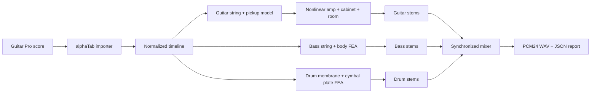

# BandEngine

BandEngine renders guitar, four-string bass, and drum-kit tracks from a Guitar Pro score entirely from the terminal. The sound is synthesized from physical and signal models; it does not use recorded instrument samples.

## Quick start

Requirements:

- Python 3.11 or newer
- Node.js and npm

Install the Python dependencies:

```powershell
python -m pip install -r requirements.txt
```

Render every supported track and mix the band:

```powershell
python band_engine.py --gp-file "song.gp5"
```

The first run installs the pinned alphaTab importer locally. The result is `song_band.wav` plus `song_band.json`.

Useful commands:

```powershell
# Inspect the score
python band_engine.py --gp-file "song.gp5" --list-tracks

# Render a short preview with separate stems
python band_engine.py --gp-file "song.gp5" --seconds 20 --stems

# Render one instrument family
python band_engine.py --gp-file "song.gp5" --only guitar --out guitar.wav
python band_engine.py --gp-file "song.gp5" --only bass --out bass.wav
python band_engine.py --gp-file "song.gp5" --only drums --out drums.wav

# Render selected Guitar Pro track indexes
python band_engine.py --gp-file "song.gp5" --track 0 --track 3 --out selected.wav
```

Supported inputs are `.gp`, `.gpx`, `.gp3`, `.gp4`, and `.gp5`. Outputs are 48 kHz stereo PCM24 WAV files.

## Pipeline



The guitar path models string stiffness, modal decay, pickup position, articulations, distortion, cabinet response, delay, and stereo room reflections. The bass path uses tension-string finite elements plus neck/body modes. The drum path uses circular membrane modes for shells and plate modes for cymbals.

All six-string guitar tracks are deliberately sent through the distortion-guitar signal chain. Bass and percussion tracks are automatically recognized from the Guitar Pro score.

## Documentation

- [Distortion guitar architecture](docs/distortion-guitar.md)
- [Bass architecture](docs/bass.md)
- [Drum architecture](docs/drums.md)

## Tests

```powershell
python -m pytest -q
```
