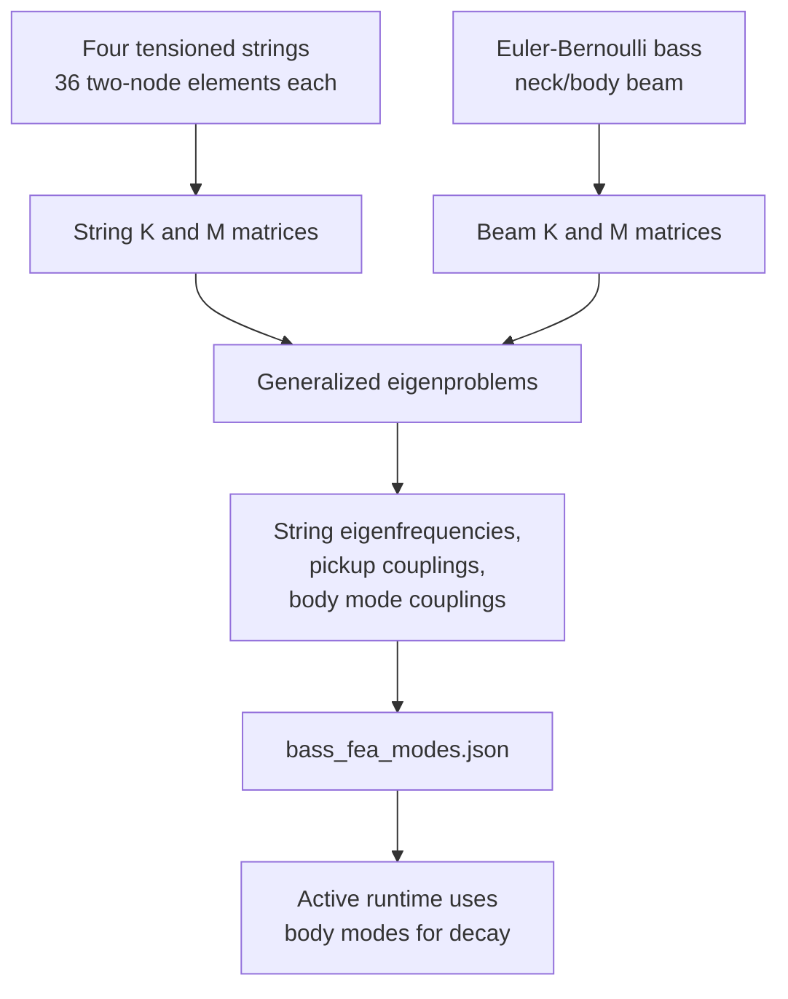
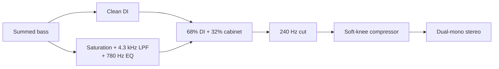

# Bass Physical-Modelling Architecture

This document explains how the four-string finger-bass sound is created in Street Session. The active application uses `tone_lab/bass/model.py`, called through `Backend/render_instrument.py`. It synthesizes a complete stereo stem offline at 48 kHz and caches it for Unreal Engine playback.

The bass combines continuum stiff-string modes, pickup geometry, precomputed body/neck FEA modes, finger-contact effects, and a parallel DI/cabinet processing chain. It does not use recorded bass samples.

## 1. Complete bass pipeline

```mermaid
flowchart LR
    GP["Guitar Pro bass staff"] --> EVENTS["Four-string BassNote events"]
    EVENTS --> GEOM["Fret, length, tension,<br/>stiffness"]
    GEOM --> MODAL["Continuum modal bank"]
    MODAL --> EXCITE["Finger-position excitation"]
    EXCITE --> PICKUP["Two-pickup response"]
    PICKUP --> DECAY["FEA body mobility decay"]
    DECAY --> CONTACT["Finger contact and fret buzz"]
    CONTACT --> STRINGMIX["Mono string sum"]
    STRINGMIX --> SPLIT["Parallel DI / cabinet split"]
    SPLIT --> COMP["EQ and compression"]
    COMP --> STEREO["Stereo stem"]
    STEREO --> BAND["Band mixer"]
    BAND --> PCM["PCM16 and WAV cache"]
```



Principal files:

- `Backend/export_score.cjs`: extracts string, fret, timing, velocity, and dead notes.
- `Backend/render_instrument.py`: converts exported events into `BassNote` objects.
- `Engines/distortion_guitar_fea/tone_lab/bass/model.py`: active bass synthesizer.
- `Engines/distortion_guitar_fea/bass_fea/bass_fea_modes.json`: saved FEA mode table.
- `Engines/distortion_guitar_fea/bass_fea/bass_model.py`: FEA model generator and an older standalone renderer.

## 2. Score-event input

The track classifier accepts a non-percussion staff with exactly four strings as bass. It preserves alternate tunings from the score.

Every note sent to the active bass engine contains:

```text
start           absolute time in seconds
duration        sounding duration in seconds
midi            sounding MIDI pitch
velocity        physical excitation strength
string_index    physical string 0..3
articulation    finger or dead
```

The adapter maps a Guitar Pro dead note to `articulation="dead"`; all other currently supported bass attacks use `articulation="finger"`.

## 3. Capo and alternate tuning

`Backend/capo.py` supplies physical nut tuning. For each event:

\[
midi=baseTuning_s+capo+writtenFret
\]

The active bass synthesizer receives the four base pitches as its tuning tuple. The current speaking length follows from the sounding fret, including capo displacement.

## 4. Physical bass constants

The active model uses:

```text
Scale length: 0.864 m
String count: 4
Reference tuning: E1 A1 D2 G2 = MIDI 28, 33, 38, 43
Sample rate: 48,000 Hz
```

Each string has a distinct approximate linear density and core diameter:

```text
Linear density: 0.0146, 0.0096, 0.0060, 0.0031 kg/m
Core diameter:  0.00052, 0.00046, 0.00040, 0.00034 m
```

## 5. String geometry and tension

The fret is:

\[
r=midi-tuning[string]
\]

The speaking length is:

\[
L=\frac{0.864}{2^{r/12}}
\]

Open-string tension is derived from linear density:

\[
T=\mu(2L_0f_{open})^2
\]

The bending-stiffness coefficient is:

\[
B=\frac{\pi^2EI}{TL^2},\qquad I=\frac{\pi d^4}{64}
\]

## 6. Continuum modal frequencies

The active synthesizer intentionally uses analytic continuum modal ratios for the audible bass string rather than replaying coarse finite-element string eigenfrequencies directly.

For mode \(n\):

\[
f_n=f_0n\sqrt{\frac{1+Bn^2}{1+B}}
\]

Dividing by \(\sqrt{1+B}\) keeps the first partial exactly at the requested score pitch while allowing upper partial stretch.

The mode count is limited by both a maximum count and an upper frequency. Frequencies above approximately 13 kHz are discarded.

## 7. Finger excitation

The player is modeled as plucking near 0.190 m from a fixed body reference. Alternating-finger and random millimeter-scale variation move this point slightly between notes.

As the fretted speaking length becomes shorter, the normalized pluck fraction changes:

\[
p=\frac{x_{finger}}{L}
\]

The initial modal amplitude contains:

\[
A_n \propto
\frac{\sin(\pi np)}{n}
\operatorname{sinc}\left(\frac{nw}{L}\right)
e^{-f_n/C(v)}
v^{1.55}
\]

This produces:

- a position-dependent harmonic comb;
- softer high-frequency content for gentle attacks;
- a brighter spectrum for higher velocity;
- consistent loudness relationships without per-note normalization.

## 8. Two-pickup magnetic response

Two pickup apertures are combined:

\[
P_n =
0.70\sin\left(\frac{\pi n x_1}{L}\right)
\operatorname{sinc}\left(\frac{n a_1}{L}\right)
+
0.30\sin\left(\frac{\pi n x_2}{L}\right)
\operatorname{sinc}\left(\frac{n a_2}{L}\right)
\]

The first pickup supplies most of the signal; the second adds body and changes the cancellation pattern. Because pickup positions remain attached to the instrument while speaking length changes, the response changes naturally with fret position.

## 9. Precomputed FEA model

`bass_fea/bass_model.py` generates `bass_fea_modes.json` from two model families.



The saved method is identified as “two-node tension-string FEA plus Euler-Bernoulli neck/body FEA.”

The active `FingerBass` renderer uses the saved body modes. It does not use the saved coarse string frequencies for audible pitch because their upper-partial dispersion depends on mesh resolution. Analytic stiff-string modes provide better continuum behavior.

## 10. Body/neck mobility and decay

For each string partial, body mobility is accumulated from the precomputed structural modes:

\[
Y(f)=\sum_r
\frac{c_r^2}
{1+[Q_r(f/f_r-f_r/f)]^2}
\]

Decay is then:

\[
T_{60,n}=
9.5\left(\frac{82}{f_n}\right)^{0.30}
\frac{1}{1+1.8Y(f_n)}
\]

Near a strongly coupled body or neck resonance, string energy decays more rapidly. This approximates energy transfer into the instrument structure.

## 11. Modal time-domain synthesis

Each partial is synthesized as:

\[
x_n(t)=A_n
e^{-\ln(1000)t/T_{60,n}}
\sin(2\pi f_nt+\phi_n)
\]

A quieter, slightly detuned secondary component creates a small two-polarization or nonlinear-string character.

A rapidly relaxing tension term causes a strong finger attack to begin minutely sharp and settle:

\[
\phi(t)=2\pi f_n\left[t+\epsilon v(1-e^{-t/\tau})\right]
\]

## 12. Contact, buzz, and release

The deterministic physical event layer adds:

- Finger contact: filtered noise around 380–2400 Hz with a short decay.
- Conditional fret buzz: 1.6–5.6 kHz noise only for sufficiently strong velocity.
- Dead note: severe modal damping plus a more prominent short touch transient.
- Note release: an exponential tail beginning at the written note-off.

The onset uses a finite rise rather than beginning at full displacement, avoiding a discontinuity.

## 13. Same-string ownership

Notes are sorted by time. For each note, the engine finds the next event on the same string. When it arrives, the previous note is damped with an approximately 2.5 ms exponential time constant.

This means:

- different strings may ring simultaneously;
- the same physical string cannot hold two unrelated frets;
- fast bass lines do not accumulate impossible overlapping tails.

## 14. Track assembly

Every synthesized note is placed into a mono array at:

\[
offset=round(start\cdot48000)
\]

All strings are summed. A 25 Hz high-pass removes numerical DC and unusable subsonic energy.

## 15. Parallel DI and cabinet path

The processing topology is:



The cabinet path applies mild oversampled saturation, a 780 Hz presence lift, and a 4.3 kHz low-pass. It is blended with clean DI so the fundamental remains strong while note definition survives under guitars.

A compressor with approximately 22 ms attack and 130 ms release controls peaks. The final active renderer returns identical left and right channels; stereo placement is applied later by the band mixer according to the Guitar Pro pan setting.

## 16. Bass stem normalization

`Backend/render_instrument.py` measures active frames, computes an RMS-based track gain, and limits that gain so the stem peak remains below approximately 0.82. One gain is applied to the entire performance; individual notes are not normalized.

The result is saved as:

```text
audio.npy   temporary floating-point stereo
audio.pcm   signed PCM16 stereo at 48 kHz
audio.wav   WAV form of the same stem
session.json
```

## 17. Band mixing

The band mixer:

- honors Guitar Pro mute and solo flags;
- measures active-only RMS;
- applies the written track volume;
- applies the track pan;
- sums bass with guitar and drums;
- scales the final mix to a peak ceiling near 0.82.

The individual bass stem remains available for Unreal's solo mode.

## 18. Animation data emitted by the bass renderer

The audio adapter currently writes a zero pitch-motion curve for every bass note:

```text
motion = [0, 0, ... 65 values total]
```

Consequently:

- bass fret and string selection animate correctly;
- alternating right-hand finger plucks animate;
- note attacks and releases synchronize with audio;
- continuous visual bass bends/slides are not currently represented by the bass audio adapter.

## 19. Limitations

- Rendering is offline rather than sample-by-sample in Unreal.
- The active string uses analytic continuum modes; FEA is used mainly for the structural mode table.
- Body coupling changes decay but is not a fully coupled string/body solver.
- Pickup and string parameters are engineering values, not measurements of a named instrument.
- Fret buzz and contact are filtered-noise approximations.
- The cabinet branch is a designed DSP coloration, not a measured bass cabinet or a cabinet FEA solve.
- Bass bend and slide metadata are not fully carried through the active adapter.

## 20. Source map

- `Backend/instrument_catalog.cjs`
- `Backend/export_score.cjs`
- `Backend/capo.py`
- `Backend/render_instrument.py`
- `Backend/band.py`
- `Engines/distortion_guitar_fea/tone_lab/bass/model.py`
- `Engines/distortion_guitar_fea/tone_lab/dsp.py`
- `Engines/distortion_guitar_fea/bass_fea/bass_model.py`
- `Engines/distortion_guitar_fea/bass_fea/bass_fea_modes.json`
