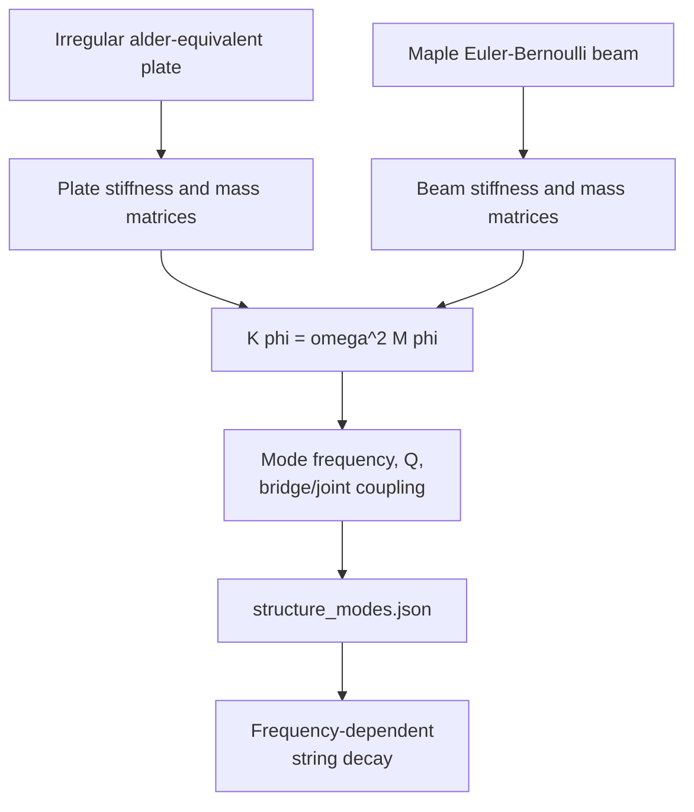

# Distortion Guitar Physical-Modelling Architecture

This document explains, from first principles, how the distortion-guitar sound in Street Session is produced. It describes the path that the application actually executes. The renderer is a deterministic, offline Python synthesizer: it renders a complete 48 kHz stereo track before Unreal Engine begins playback.

No recorded guitar samples are used. The result is nevertheless not a complete three-dimensional time-domain simulation of a guitar. It combines equation-derived strings, reduced structural modes, deterministic contact noise, nonlinear amplifier models, and a precomputed speaker/cabinet modal model.

## 1. End-to-end signal path


The principal implementation files are:

- `Backend/export_score.cjs`: imports the score and creates physical performance events.
- `Backend/prepare.py`: schedules notes, handles string choking, and invokes the distortion chain.
- `Engines/distortion_guitar_fea/tools/guitar_physics.py`: string, pickup, decay, and pitch equations.
- `Engines/distortion_guitar_fea/tools/render_solo.py`: per-gesture modal synthesizer.
- `Engines/distortion_guitar_fea/tools/amp_effects.py`: amplifier, cabinet, microphone, delay, and room chain.
- `Engines/distortion_guitar_fea/model/structure_modes.json`: precomputed guitar body/neck modes.
- `Engines/distortion_guitar_fea/model/amp_cabinet_modes.json`: precomputed speaker/cabinet modes.

## 2. Score becomes a physical event stream

The user chooses a Guitar Pro track. `export_score.cjs` loads the score through alphaTab and expands the performed order, including repeats and alternate endings. Every tempo segment is integrated into absolute seconds:

\[
\Delta t = \frac{\Delta ticks}{960}\frac{60}{tempo}
\]

Each playable note becomes an event containing:

```json
{
  "start": 0.368,
  "duration": 0.368,
  "string": 3,
  "fret": 12,
  "midi": 65,
  "target": 67,
  "articulation": "bend_up",
  "velocity": 92,
  "vibrato": 0,
  "bend": [
    {"offset": 0, "value": 0},
    {"offset": 1, "value": 2}
  ],
  "finger": 3,
  "position": 10,
  "bar": 1,
  "pick": true
}
```

The parser recognizes pick, accent, hammer-on, pull-off, palm mute, dead note, harmonic, legato slide, bend-up, bend-release, and pre-bend-release behavior. Ties extend an existing event instead of starting another independent oscillator.

Velocity is derived from the written Guitar Pro dynamic, accents, and ghost-note state. It controls both amplitude and brightness rather than serving as a final volume multiplier only.

## 3. Tuning, capo, and geometry

For a six-string guitar, the model stores physical nut tuning separately from the sounding tuning at the capo.

\[
midi = baseTuning[string] + capo + writtenFret
\]

The physical engine is configured with `baseTuning`. This is important: passing the capo-raised pitch as the open-string tuning would model a full-length string under greater tension. A real capo keeps the original tension approximately intact and shortens the speaking length.

The physical fret is therefore:

\[
fret_{physical}=capo+fret_{written}
\]

Notes beyond physical fret 24 are rejected before synthesis.

## 4. String equations

The electric guitar uses a scale length of 0.648 m. Each string has a core diameter and linear density.

### 4.1 Fundamental frequency

For MIDI note number \(m\):

\[
f_0 = 440\,2^{(m-69)/12}
\]

### 4.2 Speaking length

At fret \(r\):

\[
L(r)=\frac{L_0}{2^{r/12}}
\]

where \(L_0=0.648\text{ m}\).

### 4.3 Open-string tension

The ideal-string relationship is rearranged to obtain tension:

\[
T=\mu(2L_0f_{open})^2
\]

Here \(\mu\) is linear density and \(f_{open}\) is the physical open-string frequency at the nut.

### 4.4 Stiffness and inharmonicity

The string core's second moment of area is:

\[
I=\frac{\pi d^4}{64}
\]

The inharmonicity coefficient is:

\[
B=\frac{\pi^2EI}{TL^2}
\]

with steel Young's modulus \(E=2.0\times10^{11}\text{ Pa}\).

The distortion renderer places partial \(n\) near:

\[
f_n=n f_0\sqrt{1+Bn^2}
\]

This stretches upper partials slightly above ideal integer multiples.

## 5. Pluck excitation

The model treats a pluck as a finite-width displacement/contact applied at a location along the string. The partial amplitude contains three important terms:

\[
A_n \propto
\frac{\sin(\pi n p)}{n^{1.62}}
\operatorname{sinc}(nw)
e^{-n/C(v)}
\]

where:

- \(p\) is the pluck-position fraction;
- \(w\) is the pick-contact width;
- \(v\) is velocity;
- \(C(v)\) makes stronger notes brighter.

The sign of `sin(pi*n*p)` is retained. This matters because a physical triangular displacement contains phase-coherent positive and negative modal coefficients. Rectifying this comb would destroy cancellations and make the attack more synthetic.

Small deterministic random phase and contact variations prevent every note from having an identical microscopic transient while keeping repeated renders reproducible.

## 6. Magnetic pickup model

The pickup samples string velocity over a finite magnetic aperture. For partial number \(n\):

\[
P_n=\sin(\pi n x_p)\operatorname{sinc}(na)
\]

where \(x_p\) is pickup position and \(a\) is aperture width as a fraction of the string.

This causes physical comb cancellations: any partial whose node lies near the pickup contributes little voltage. The distortion path uses the middle pickup position. A frequency factor is also applied because magnetic pickup voltage is related to string velocity, not displacement alone.

## 7. Guitar body and neck coupling

`structure_modes.json` is generated by `tools/structure_fea.py`. The generator solves two generalized eigenproblems:



At runtime, modal mobility is approximated as:

\[
Y(f)=\sum_r
\frac{c_r^2}
{1+\left[Q_r(f/f_r-f_r/f)\right]^2}
\]

and the partial decay is shortened near strongly coupled structural resonances:

\[
T_{60}(f)=
\operatorname{clip}\left(
\frac{T_{base}(f)\,L_{fret}}
{1+6.2Y(f)},
0.22,14.0
\right)
\]

The full finite-element mesh is not evaluated for each note. Only the reduced mode table is used during audio rendering.

## 8. Pitch trajectories and articulations

The engine constructs a continuous pitch curve in semitone units. Smoothstep trajectories control when a gesture begins and ends.

Examples:

- Bend up: hold briefly, then rise smoothly.
- Bend release: rise, hold, then return.
- Pre-bend release: begin at the bent pitch and relax downward.
- Legato slide: hold the source fret for most of the note, then move near the end.
- Hammer-on or pull-off: complete the transition during roughly the first 8%.
- Vibrato: a 5.6 Hz sinusoidal pitch modulation faded in after the attack.

Instantaneous oscillator phase is integrated from the changing frequency:

\[
\phi_n[k]=\phi_n[k-1]+\frac{2\pi f_n[k]}{F_s}
\]

This produces a continuous bend or slide rather than a crossfade between static pitches.

## 9. Per-note modal oscillator bank

For every event, `LeadGuitar.gesture()` creates an oscillator bank. A simplified partial is:

\[
x_n(t)=A_nP_nE_a
e^{-\ln(1000)t/T_{60,n}}
\sin\left(\phi_n(t)+\phi_{0,n}\right)
\]

The final note is the sum of all partials below the anti-aliasing limit. A slightly detuned, faster-decaying secondary term adds transverse/string complexity.

The engine does not normalize every note. It divides by an excitation-derived modal bound, preserving the intended hierarchy between pick, hammer-on, pull-off, tap, and legato levels.

Additional mechanisms are added according to articulation:

- Pick/accent: short filtered differentiated-noise contact.
- Hammer/pull/tap: short fret-contact noise.
- Slide: band-passed scrape multiplied by pitch-motion speed.
- Palm mute: strong bridge termination loss.
- Dead note: very fast pitched decay plus contact energy.
- Pinch harmonic: suppresses the fundamental and emphasizes partials around 4–5.

## 10. Same-string state rule

The distortion branch renders notes separately, but enforces a physical ownership rule: one string cannot sustain two independently fretted notes.

Before mixing a rendered note, `prepare.py` finds the next event on the same string. At that next onset, the preceding note receives an approximately 6 ms exponential choke. Chords remain possible because different strings retain independent tails.

## 11. Mono guitar assembly

Every note is placed at:

\[
sampleOffset=\lfloor start\cdot48000\rfloor
\]

and scaled using a nonlinear velocity curve:

\[
g(v)=\left(0.17+0.83\frac{v}{127}\right)^{1.3}
\]

All notes are accumulated into one mono direct-injection signal before the nonlinear amplifier. This ordering is significant: simultaneous notes intermodulate inside the distortion stages as they would through a shared amplifier.

## 12. Pickup load and compressor

The amplifier chain first removes subsonic content, adds a broad loaded-pickup/cable resonance around 3.65 kHz, and low-passes at 9 kHz.

A three-band compressor splits the signal into low, mid, and high regions with different thresholds and ratios. The detector is RMS-like, with fast attack and slower gain recovery. This controls peaks before high gain without erasing the note envelope.

## 13. Oversampled high-gain preamplifier

The nonlinear part is upsampled by four, from 48 kHz to 192 kHz. Although a source comment says “2x,” the executable call is `resample_poly(x,4,1)`.

The high-gain chain contains:

1. A fast downward expander/noise gate.
2. A 92 Hz high-pass to reduce low-frequency intermodulation.
3. A 720 Hz resonance.
4. Four differently biased soft-clipping stages using `tanh`, quadratic, and cubic asymmetry.
5. Interstage high-pass and low-pass filters.
6. A small dry component to preserve pick definition.

Conceptually:

\[
y_1=\tanh(g_1x+a_1x^2)
\]

\[
y_2=\tanh(g_2H_1(y_1)-a_2y_1^2+b_2y_1^3)
\]

with filtering between stages. The interstage filters are essential; cascaded gain without them would produce broadband digital fizz.

## 14. Tone stack and power amplifier

The tone stack separates low, mid, high, and presence regions and recombines them with fixed gains.

The power-amplifier stage models:

- slow supply-envelope tracking;
- voltage sag under strong signal;
- asymmetric even-order contribution;
- push-pull soft saturation;
- transformer-like high-pass and low-pass bandwidth.

After this section, the signal is resampled back to 48 kHz.

## 15. Speaker and cabinet FEA

`amp_cabinet_modes.json` is generated by `tools/cabinet_fea.py`.

The generator models:

- a 12-inch tensioned paper cone with bending rigidity;
- open-back plywood cabinet panels;
- voice-coil drive location;
- center-microphone coupling;
- edge-microphone coupling.

It solves:

\[
K\phi_r=\omega_r^2M\phi_r
\]

and stores frequency, Q, drive coupling, and microphone residues for each retained mode.

At runtime, each mode becomes a resonator driven by the power-amplifier output. A conventional speaker-band base response is combined with these modal resonances. Small nonlinear cone-breakup terms are also added.

This is a reduced modal coloration model, not a measured cabinet impulse response.

## 16. Microphones, stereo space, and delay

Two virtual signals are formed:

- center microphone;
- edge microphone.

The right channel receives a 43-sample delayed edge component, creating width while leaving the lead centered.

A tempo-synchronized dotted-eighth delay is then generated:

\[
t_d=0.75\frac{60}{BPM}
\]

Three ping-pong repeats are added with decreasing gain. Their delays contain very small sinusoidal modulations. Additional fixed early reflections create a compact stereo room.

Finally, DC is removed and the stereo signal is peak-scaled.

## 17. Stem output and caching

The result is stored as:

- `audio.pcm`: little-endian signed 16-bit stereo, 48 kHz;
- `audio.wav`: equivalent WAV container;
- `session.json`: events, pitch-motion curves, bars, metadata, file paths, and waveform overview.

The session key hashes the score, track, duration, backend code, engine code, and model tables. An unchanged request loads the existing stem instead of rendering again.

## 18. Actual limitations

- Rendering is offline, not inside Unreal's real-time audio callback.
- The string is a modal sum, not a spatial FDTD or finite-element string at audio rate.
- Structural FEA affects decay; there is no full bidirectional string/body time-domain coupling.
- Pick, fret, and scrape noise are stochastic engineering models.
- Amplifier nonlinearities are white-box approximations, not a transistor/tube circuit solver.
- Cabinet modes are computed, but the base response and cone breakup contain designed DSP terms.
- “Overdrive” is not currently a distinct active signal path. The UI maps it to the distortion renderer even though an unused `dual_stage_overdrive()` function exists.

## 19. Source map

- `Backend/prepare.py`: `build()`
- `Backend/export_score.cjs`: `exportScore()`
- `Backend/capo.py`: `physical_tuning()`
- `Engines/distortion_guitar_fea/tools/guitar_physics.py`
- `Engines/distortion_guitar_fea/tools/render_solo.py`: `LeadGuitar`
- `Engines/distortion_guitar_fea/tools/amp_effects.py`: `process_lead_chain()`
- `Engines/distortion_guitar_fea/tools/structure_fea.py`
- `Engines/distortion_guitar_fea/tools/cabinet_fea.py`
- `Engines/distortion_guitar_fea/model/structure_modes.json`
- `Engines/distortion_guitar_fea/model/amp_cabinet_modes.json`
