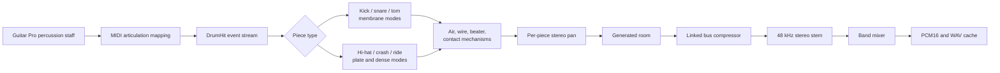
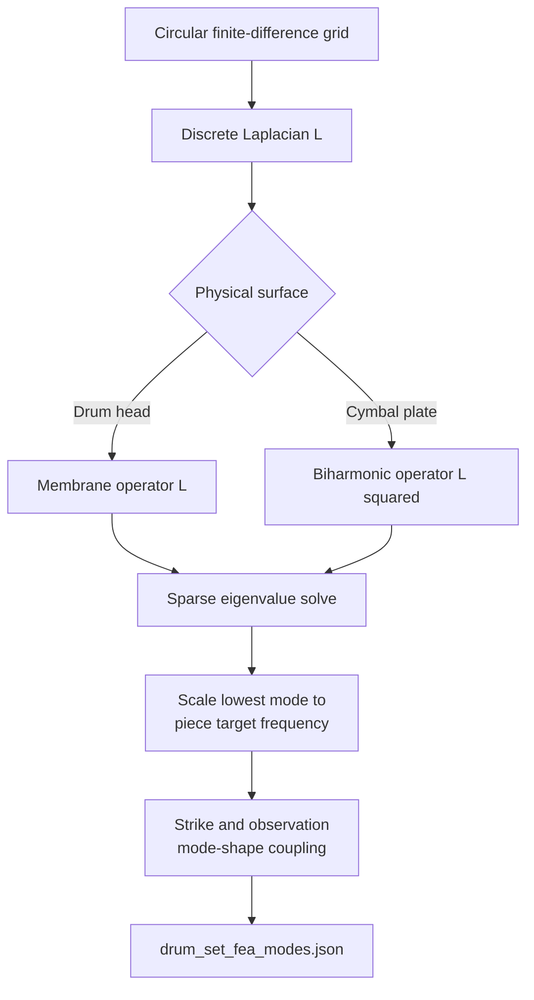
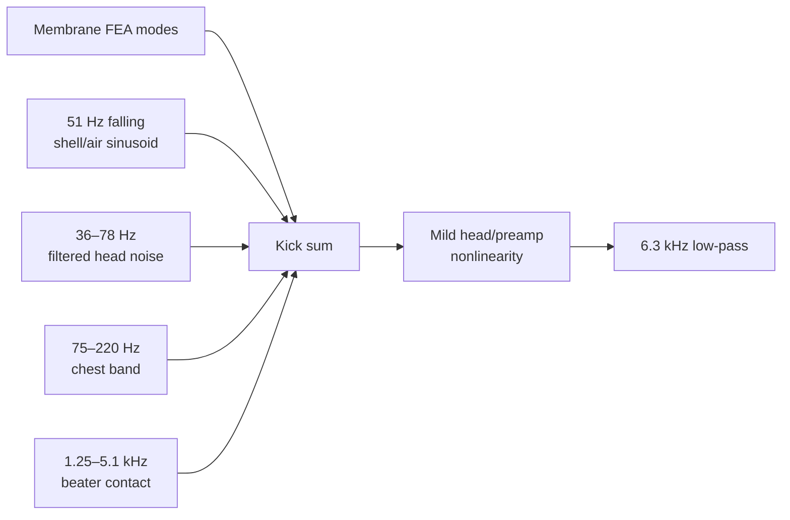

# Drum Physical-Modelling Architecture

This document explains, from first principles, how Street Session produces its acoustic drum-kit sound. The active renderer is `Engines/distortion_guitar_fea/tone_lab/drums/model.py`, invoked through `Backend/render_instrument.py`.

The engine is a hybrid physical model. Kick, snare, and tom structure comes from reduced membrane FEA modes. Cymbals use saved plate modes plus deterministic dense statistical modes and collision noise. Shell air, beater contact, snare wires, room response, and other unresolved phenomena are modeled with explicit signal-processing approximations. No recorded drum samples are used.

## 1. Complete drum pipeline



Principal files:

- `Backend/instrument_catalog.cjs`: maps percussion MIDI numbers to kit pieces.
- `Backend/export_score.cjs`: exports timed hits and assigns visible limbs.
- `Backend/render_instrument.py`: converts events to `DrumHit` objects.
- `Engines/distortion_guitar_fea/tone_lab/drums/model.py`: active drum synthesis.
- `Engines/distortion_guitar_fea/drum_set_fea/drum_model.py`: FEA table generator and older standalone renderer.
- `Engines/distortion_guitar_fea/drum_set_fea/drum_set_fea_modes.json`: primary modal table.
- `Engines/distortion_guitar_fea/drum_set_fea/tab3_drums_fea_modes.json`: extended tom table.

## 2. Percussion score import

Guitar Pro percussion notes may use articulation indexes rather than direct note numbers. The importer first resolves the track's percussion-articulation table to an output MIDI number, then maps it to a supported physical piece.

Supported mappings include:

```text
35, 36       kick
37–40, 91    snare
41, 43       floor tom
45           low tom
47           mid tom
48, 50       high tom
42, 44, 46   hi-hat
49, 52, 55,
57           crash
51, 53, 59,
93           ride
```

Unsupported percussion notes are omitted with a warning rather than being silently remapped to an unrelated sound.

## 3. DrumHit event contract

Each audible hit becomes:

```json
{
  "start": 1.250,
  "piece": "hihat",
  "velocity": 94,
  "openAmount": 1.0,
  "limb": 1
}
```

The synthesis fields are:

- `start`: absolute performance time in seconds;
- `piece`: physical kit component;
- `velocity`: amplitude and brightness control;
- `openAmount`: hi-hat opening from closed/pedal toward open.

`limb` is used by Unreal animation and does not change the audio calculation.

## 4. Velocity construction

Velocity is derived from the Guitar Pro beat dynamic, accent, and ghost state. It is clipped to a practical range.

The active renderer converts it to:

\[
v=\operatorname{clip}(velocity/127,0,1)
\]

Velocity controls:

- total amplitude;
- spectral low-pass cutoff;
- membrane pitch fall;
- contact-noise level;
- fixed per-piece nonlinear response.

It is applied before the piece's fixed gain. A ghost note therefore remains quieter than a normal stroke; hits are not individually peak-normalized.

## 5. Offline FEA model creation

`drum_set_fea/drum_model.py` creates reduced modal tables. It builds a circular grid and retains nodes inside the drum or cymbal radius.



The underlying modal equation is:

\[
K\phi_r=\omega_r^2M\phi_r
\]

For membrane pieces the Laplacian is the spatial operator. For plate pieces the Laplacian is squared to approximate bending behavior. The eigenvalue is converted to angular frequency with a square root in both cases because the plate operator is already biharmonic.

The primary model contains kick, snare, hi-hat, and crash. The active renderer loads an extended table to fill missing tom pieces. Ride and high-density cymbal behavior are augmented at runtime.

## 6. Reduced modal synthesis

For kick, snare, and toms, up to approximately 20 retained modes are synthesized. A basic mode is:

\[
x_r(t)=w_r e^{-t/\tau_r}\sin(\phi_r(t))
\]

where:

- \(w_r\) is FEA-derived spatial coupling;
- \(\tau_r\) is a piece- and mode-dependent decay;
- \(\phi_r(t)\) may include a short downward pitch movement.

The sum is multiplied by a fast attack ramp so the modeled head starts near zero displacement rather than producing a sample discontinuity.

## 7. Kick drum model

The kick is assembled from several physical layers:



The pitch-fall phase is designed so a strong kick begins at slightly higher effective tension and relaxes downward. This is paired with an explicit 51 Hz body component.

Filtered noise represents broad shell, head, and beater radiation that a small retained modal bank cannot resolve. A mild nonlinear term creates upper harmonics so the kick remains audible on speakers that cannot reproduce its fundamental.

## 8. Snare model

The snare combines:

- membrane FEA modes;
- low/mid head-body noise;
- high-frequency snare-wire noise;
- mid-frequency wire noise;
- delayed wire bloom;
- uneven wire chatter modulation;
- a short crack transient.

The wire envelope begins after the head impact:

\[
e_{wire}(t)=
(1-e^{-t/\tau_a})
\left(ae^{-t/\tau_1}+be^{-t/\tau_2}\right)
\]

This avoids making the wire response appear instantaneously before the struck head can excite the lower head and wires.

A high-pass near 110 Hz removes inappropriate low-frequency energy.

## 9. Tom model

High, mid, low, and floor toms use piece-specific membrane modes and base decay constants. They add:

- a 700–5200 Hz stick-contact band;
- an 80–450 Hz enclosed-air/body band;
- a high-frequency low-pass.

The larger/lower toms receive longer tails than the high tom. Their FEA modes come from the extended modal table when not present in the primary table.

## 10. Hi-hat, crash, and ride

Metal percussion cannot be represented convincingly by a few low plate modes. The active engine therefore creates a fixed dense set of irregular frequencies when the kit object is constructed:

```text
Hi-hat: 256 modes, roughly 1.3–17.7 kHz
Crash:  512 modes, roughly 0.44–18.4 kHz
Ride:   384 modes, roughly 0.72–17.0 kHz
```

The frequency grid is jittered deterministically and stored for the lifetime of the kit. Each hit changes phase, contact noise, and small coupling factors, but the instrument's modal frequencies remain stable.

Each metal mode is:

\[
x_n(t)=A_n
e^{-t/\tau_n}
\sin(2\pi f_nt+\phi_n)
\]

with frequency-dependent decay:

\[
\tau_n=\tau_0\left(\frac{5000}{f_n}\right)^{0.32}
\]

Dense modes are combined with high- and mid-band collision noise to create the wash. This is explicitly statistical sound design layered around a modal physical framework, not a full nonlinear cymbal simulation.

## 11. Hi-hat openness and choking

Hi-hat `openAmount` changes decay time:

\[
\tau_{hat}=0.034+0.23\,openAmount
\]

It also extends the total tail. An open hi-hat may overlap later open strokes. A following closed or pedal hit searches backward through the event order and truncates the existing open-hat tail shortly after the closing event.

This models the physical cymbals being forced together rather than treating every hi-hat sound as an independent sample.

## 12. Spectral shaping and fixed piece gain

Before output, every hit receives a velocity-dependent low-pass:

\[
f_c=\min(18500,4500+13000v)
\]

Amplitude is then:

\[
y(t)=L_{piece}\,v^{1.65}\,s\,x(t)
\]

where:

- \(L_{piece}\) is a fixed kit balance;
- \(s\) is a small deterministic stick-position factor.

This preserves performance dynamics across hits.

## 13. Stereo kit layout

Each piece has a fixed pan position:

```text
Kick       center
Snare      slightly left
Hi-hat     left
Crash      left
Ride       right
High tom   left
Mid tom    near-left
Low tom    right
Floor tom  farther right
```

Constant-power coefficients distribute a mono hit into the stereo result:

\[
L=\sqrt{\frac{1-p}{2}}x,
\qquad
R=\sqrt{\frac{1+p}{2}}x
\]

## 14. Room and bus processing

The assembled kit is high-passed near 27 Hz, then sent into the generated room function in `tone_lab/dsp.py`.

The room uses:

- deterministic filtered-noise impulse tails;
- different left/right seeds and path delays;
- explicit early reflections;
- cross-channel sends;
- FFT convolution.

It is a synthetic studio room, not a measured impulse response.

A gentle linked stereo compressor catches peaks while retaining drum transients. Its attack is deliberately slower than the initial hit.

## 15. Limb assignment for animation

After audio-event export, `export_score.cjs` assigns animation limbs:

- kick uses limb 2, handled by the kick-beater animation;
- pedal hi-hat uses limb 3;
- snare normally prefers the left hand;
- hi-hat and ride normally prefer the right hand;
- toms and crash alternate hands;
- simultaneous collisions cause reassignment to the free hand where possible.

If more than two simultaneous stick hits are written, the audio still contains the hits but the visual hand motion is marked as approximate.

## 16. Stem output and mixing

The complete kit is rendered to a stereo floating-point array for the selected song duration plus tail. The adapter applies one performance-wide gain, then writes:

```text
audio.npy
audio.pcm
audio.wav
session.json
```

The band mixer gives drums their own active-RMS target, honors written mute/solo state, and includes the stem in the final band mix. The unchanged individual stem remains available for Unreal's solo mode.

## 17. Determinism

The active kit uses fixed seeds for:

- instrument-level modal distributions;
- per-performance hit variations;
- room response.

Therefore the same score, code, and settings produce the same waveform. This is necessary for content-addressed caching and reproducible verification.

## 18. Limitations

- Synthesis is offline, not inside Unreal's audio callback.
- The FEA model is linear and reduced; real drum heads and cymbals are nonlinear, tension-dependent structures.
- Shells, lugs, stands, coupled heads, and full air volumes are not solved as a single system.
- Cymbal density is largely statistical rather than entirely FEA-derived.
- Contact, snare wires, and air radiation use filtered-noise approximations.
- Ride is filled by the active dense-metal model rather than a dedicated saved ride FEA entry.
- Every audible hit can exist even when a score requests more simultaneous hits than two animated hands can physically show.

## 19. Source map

- `Backend/instrument_catalog.cjs`
- `Backend/export_score.cjs`
- `Backend/render_instrument.py`
- `Backend/band.py`
- `Engines/distortion_guitar_fea/tone_lab/drums/model.py`
- `Engines/distortion_guitar_fea/tone_lab/dsp.py`
- `Engines/distortion_guitar_fea/drum_set_fea/drum_model.py`
- `Engines/distortion_guitar_fea/drum_set_fea/drum_set_fea_modes.json`
- `Engines/distortion_guitar_fea/drum_set_fea/tab3_drums_fea_modes.json`
